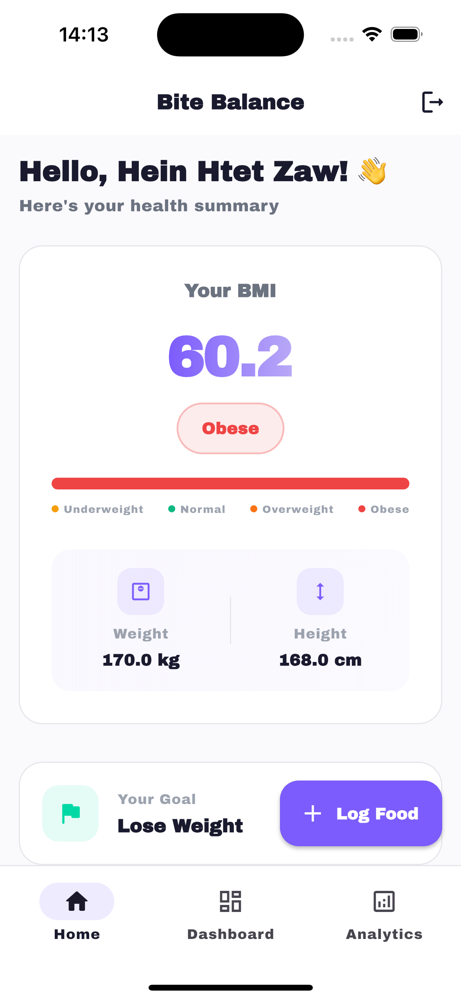
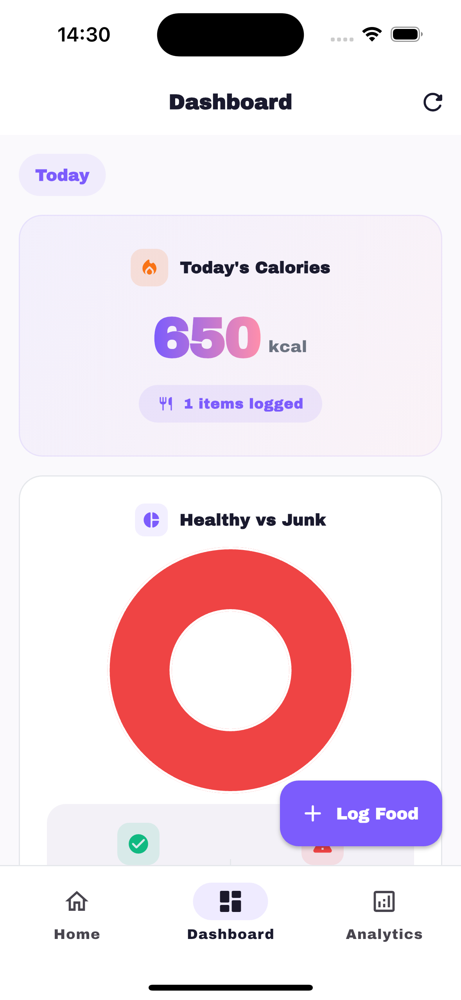
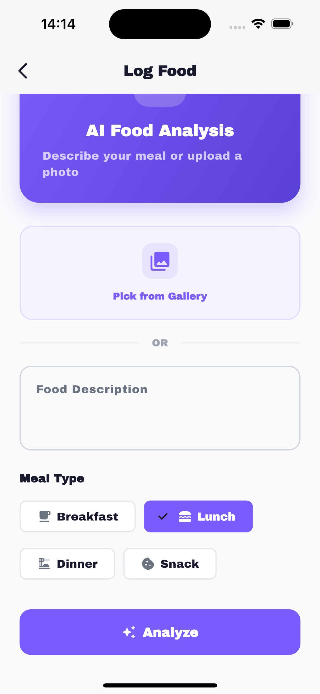

# 🥗 Bite Balance

An AI-powered food tracker Flutter app that helps users log daily meals, analyze nutrition with Gemini AI, and track calorie intake with personalized BMI-based health recommendations.

---

## ✨ Features

- 🔐 Register / Login / Logout
- 👤 Profile setup — name, weight, height, goal
- 📊 BMI calculation with category indicator
- 📝 Log food by text or photo
- 🤖 AI food analysis — calories, healthy/junk classification
- 🎯 Personalized daily calorie target based on BMI
- 📈 Daily calorie dashboard with healthy vs junk breakdown
- 📅 Weekly & monthly stats with charts
- 🏆 Most eaten junk food tracking
- 🌐 Responsive — mobile & web support

## 🛠 Tech Stack

| Technology | Usage |
|-----------|-------|
| Flutter + Dart | Mobile & Web UI |
| Supabase | Auth + Database |
| Riverpod | State management |
| GoRouter | Navigation with auth guard |
| Gemini API | Food analysis + Vision |
| fl_chart | Analytics charts |

---

## 📁 Project Structure

```
lib/
├── core/
│   ├── constants/      # Colors, strings, theme
│   ├── errors/         # Failure classes
│   ├── router/         # GoRouter config
│   └── usecases/       # Base usecase class
│
├── features/
│   ├── auth/           # Register, Login, Logout
│   │   ├── data/
│   │   ├── domain/
│   │   └── presentation/
│   ├── profile/        # Profile setup, BMI
│   │   ├── data/
│   │   ├── domain/
│   │   └── presentation/
│   ├── food_log/       # Food logging, Gemini analysis
│   │   ├── data/
│   │   ├── domain/
│   │   └── presentation/
│   └── analytics/      # Daily/weekly/monthly stats
│       ├── data/
│       ├── domain/
│       └── presentation/
│
└── main.dart
```

---

## 📸 Screenshots

| Home | Dashboard | Log Food                                     |
|------|-----------|----------------------------------------------|
|  |  |  |

---

## 🚀 Getting Started

### Prerequisites
- Flutter SDK 3.0+
- Dart 3.0+
- Supabase account
- Gemini API key

### Installation

**1. Clone the repo**
```bash
git clone https://github.com/heinhtet-zaw12/BiteBalance.git
cd BiteBalance
```

**2. Install dependencies**
```bash
flutter pub get
```

**3. Setup environment variables**
```bash
cp .env.example .env
```

`.env` file ထဲ values ဖြည့်ပါ —
```
SUPABASE_URL=your-supabase-url
SUPABASE_ANON_KEY=your-anon-key
GEMINI_API_KEY=your-gemini-key
```

**4. Setup Supabase**

Supabase dashboard မှာ ဒီ SQL run ပါ —
```sql
create table profiles (
  id uuid references auth.users primary key,
  full_name text,
  weight numeric,
  height numeric,
  goal text check (goal in ('lose','maintain','gain')),
  created_at timestamptz default now()
);

create table food_logs (
  id uuid default gen_random_uuid() primary key,
  user_id uuid references auth.users,
  food_name text,
  calories numeric,
  is_junk boolean,
  meal_type text,
  created_at timestamptz default now()
);

alter table profiles enable row level security;
alter table food_logs enable row level security;

create policy "Users own profile"
on profiles for all using (auth.uid() = id);

create policy "Users own food logs"
on food_logs for all using (auth.uid() = user_id);
```

**5. Run the app**
```bash
# Mobile
flutter run

# Web
flutter run -d chrome
```

---

## 🤖 Claude Code Setup

This project was built with Claude Code using MCP, Skills, and Agents.

```bash
# Install Claude Code
npm install -g @anthropic-ai/claude-code

# Run in project folder
cd BiteBalance
claude
```

MCP config example in `.mcp.json.example` 👆