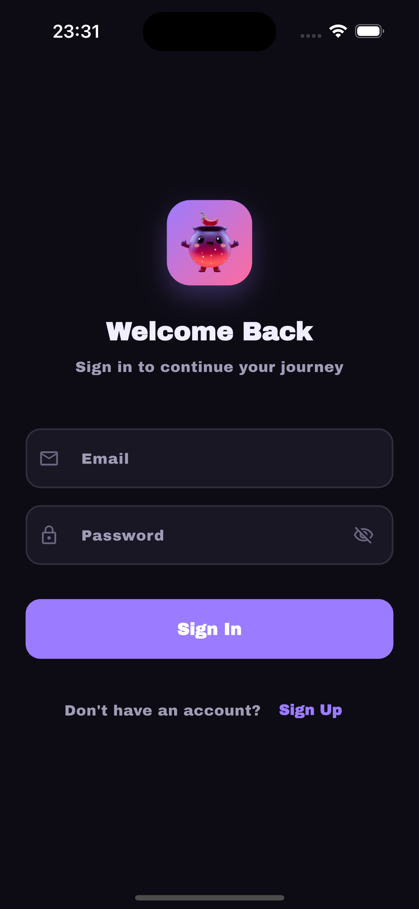
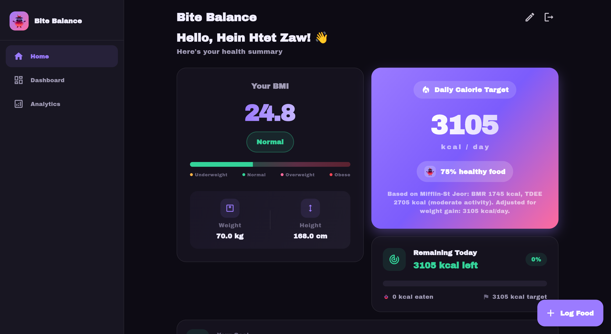
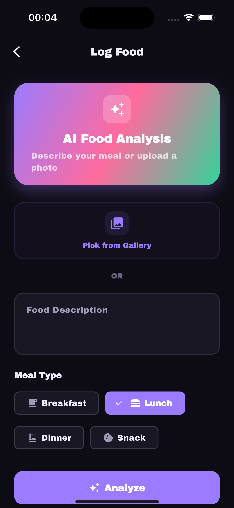
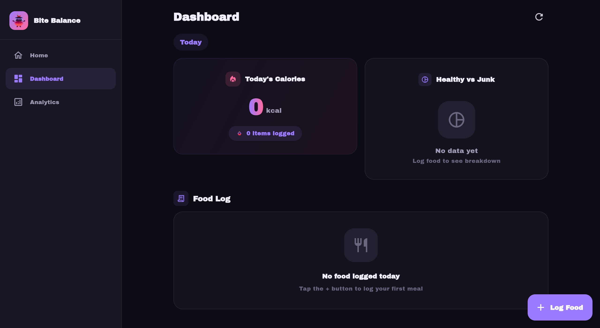
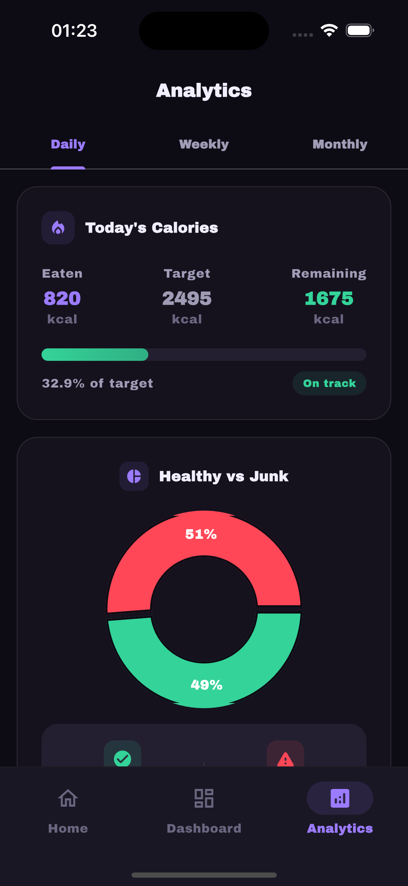

<div align="center">
  
  <h1>🥗 Bite Balance</h1>
  <p><strong>AI-powered calorie tracking &amp; nutrition analysis app</strong></p>
  <p>
    
    
    
    
  </p>
</div>

---

## 📖 About

**Bite Balance** helps health-conscious individuals track their daily food intake, analyze nutrition with AI, and get personalized health insights based on BMI and eating habits. Snap a photo or type a meal description — the app identifies the food, estimates calories, and classifies it as healthy or junk.

Built with **Clean Architecture** (feature-first) following strict separation of concerns: Domain → Data → Presentation.

---

## ✨ Features

| Feature | Description |
|---------|------------|
| 🔐 **Auth** | Register / Login / Logout with Supabase, email confirmation, auth-guarded routes |
| 👤 **Profile Setup** | Full name, weight, height, fitness goal (lose / maintain / gain) |
| 📊 **BMI Dashboard** | Local BMI calculation with category labels (Underweight → Obese) and color indicators |
| 🤖 **AI Food Analysis** | Text or photo-based food recognition via Gemini AI — auto-detects food name, calories, healthy/junk classification |
| 📝 **Food Logging** | Log meals from camera or gallery; AI populates nutrition fields |
| 📈 **Analytics** | Daily calorie dashboard with healthy vs. junk breakdown, weekly & monthly stats via `fl_chart` |
| 🏆 **Junk Food Tracking** | See your most-eaten junk foods at a glance |
| 🌐 **Cross-Platform** | Built with Flutter — runs on iOS, Android, and web |

---

## 🛠 Tech Stack

| Technology | Usage |
|-----------|-------|
| **[Flutter](https://flutter.dev)** + **[Dart](https://dart.dev)** | Cross-platform UI framework |
| **[Supabase](https://supabase.com)** | Auth (email/password) + PostgreSQL database |
| **[Riverpod](https://riverpod.dev)** (`flutter_riverpod`) | State management with `AsyncNotifier` |
| **[GoRouter](https://pub.dev/packages/go_router)** | Declarative routing with auth redirect guards |
| **[Gemini AI](https://ai.google.dev)** (`google_generative_ai`) | Food recognition & nutrition analysis from text/photos |
| **[fl_chart](https://pub.dev/packages/fl_chart)** | Interactive charts for analytics |
| **[fpdart](https://pub.dev/packages/fpdart)** | Functional programming helpers (Either, TaskEither) |
| **[flutter_dotenv](https://pub.dev/packages/flutter_dotenv)** | Environment variable management |
| **[Google Fonts](https://pub.dev/packages/google_fonts)** | Custom typography |
| **[Lottie](https://pub.dev/packages/lottie)** | Animated splash & onboarding graphics |
| **[Shimmer](https://pub.dev/packages/shimmer)** | Loading skeletons |
| **[image_picker](https://pub.dev/packages/image_picker)** | Camera & gallery access for food photos |

---

## 📁 Project Structure

```
lib/
├── core/
│   ├── constants/           # AppColors, AppStrings, AppEndpoints
│   ├── errors/              # Failure classes
│   ├── router/              # GoRouter config with auth guard
│   ├── theme/               # AppTheme (light mode)
│   ├── usecases/            # Abstract base usecase
│   └── utils/               # Logger, URL strategy
│
├── features/
│   ├── auth/                # Register, Login, Logout, Email confirmation
│   │   ├── data/            # Supabase datasource, UserModel
│   │   ├── domain/          # User entity, AuthRepository interface
│   │   └── presentation/    # AuthProvider, LoginPage, RegisterPage, widgets
│   │
│   ├── profile/             # Profile setup, BMI calculation
│   │   ├── data/            # Supabase datasource, ProfileModel
│   │   ├── domain/          # Profile entity, BMI logic
│   │   └── presentation/    # ProfileProvider, ProfileSetupPage, HomePage
│   │
│   ├── food_log/            # AI food analysis, meal logging
│   │   ├── data/            # Gemini datasource, FoodLogModel
│   │   ├── domain/          # FoodLog entity, MealType enum
│   │   └── presentation/    # FoodLogProvider, FoodLogPage
│   │
│   ├── dashboard/           # Daily calorie summary
│   │   ├── data/
│   │   ├── domain/
│   │   └── presentation/    # DashboardPage
│   │
│   ├── analytics/           # Weekly & monthly charts
│   │   ├── data/
│   │   ├── domain/
│   │   └── presentation/    # AnalyticsPage
│   │
│   ├── splash/              # Animated splash screen
│   │   └── presentation/    # SplashPage
│   │
│   └── main/                # Bottom navigation shell
│       └── presentation/    # MainScaffold
│
└── main.dart                # App entry point
```

---

## 📸 Screenshots

| Login | Home & BMI | Food Log |
|---|---|---|
|  |  |  |

| Dashboard | Analytics |
|---|---|
|  |  |

---

## 🚀 Getting Started

### Prerequisites

- **Flutter SDK** 3.10+
- **Dart** 3.0+
- A **[Supabase](https://supabase.com)** account (free tier works)
- A **[Gemini API key](https://ai.google.dev)** (free tier available)

### Installation

**1. Clone the repository**

```bash
git clone https://github.com/heinhtet-zaw12/bite_balance.git
cd bite_balance
```

**2. Install dependencies**

```bash
flutter pub get
```

**3. Set up environment variables**

Copy `.env.example` to `.env` and fill in your credentials:

```bash
cp .env.example .env
```

```
SUPABASE_URL=https://your-project.supabase.co
SUPABASE_ANON_KEY=your-supabase-anon-key
GEMINI_API_KEY=your-gemini-api-key
```

> ⚠️ Never commit `.env` to version control — it's already in `.gitignore`.

**4. Create the database table**

Run this SQL in your Supabase SQL editor:

```sql
CREATE TABLE profiles (
  id          UUID REFERENCES auth.users PRIMARY KEY,
  full_name   TEXT,
  weight      NUMERIC,
  height      NUMERIC,
  goal        TEXT CHECK (goal IN ('lose', 'maintain', 'gain')),
  created_at  TIMESTAMPTZ DEFAULT NOW(),
  updated_at  TIMESTAMPTZ DEFAULT NOW()
);

ALTER TABLE profiles ENABLE ROW LEVEL SECURITY;

CREATE POLICY "Users can only access own profile"
  ON profiles
  FOR ALL
  USING (auth.uid() = id);
```

**5. Run the app**

```bash
# Mobile
flutter run

# Web
flutter run -d chrome
```

---

## 🌐 Deployment

This project includes a `vercel.json` for easy web deployment via [Vercel](https://vercel.com). Simply connect your repository and Vercel will auto-detect the Flutter web build.

For production builds:

```bash
flutter build web
```

---

## 🧱 Architecture Highlights

- **Clean Architecture** with strict dependency rule — Domain layer has zero imports from Flutter or Supabase
- **Feature-first folder structure** — every feature is self-contained with its own data/domain/presentation layers
- **Functional error handling** via `fpdart`'s `Either` type — no exceptions thrown from domain or data layers
- **Auth-guarded routes** — GoRouter redirects unauthenticated users to the login page
- **All async state** managed through Riverpod `AsyncValue` — loading / error / success states everywhere

---

## 🤖 Built with Claude Code

This project was developed with [Claude Code](https://claude.ai/code) using MCP tools, agents, and workflows.

```bash
# Install Claude Code
npm install -g @anthropic-ai/claude-code

# Run in project folder
cd bite_balance
claude
```

---

## 📄 License

This project is for educational and personal use.

---

<div align="center">
  <sub>Built with ❤️ by <a href="https://github.com/heinhtet-zaw12">@heinhtet-zaw12</a></sub>
</div>
